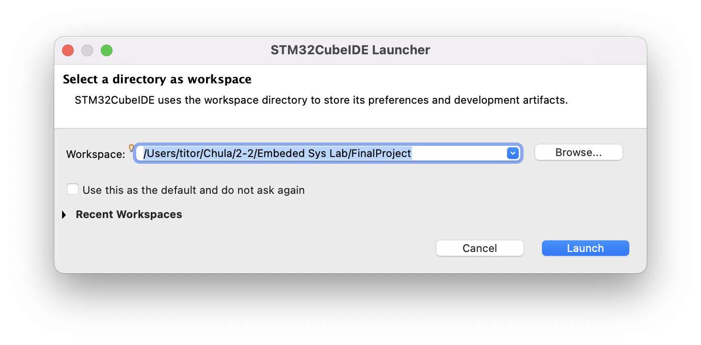
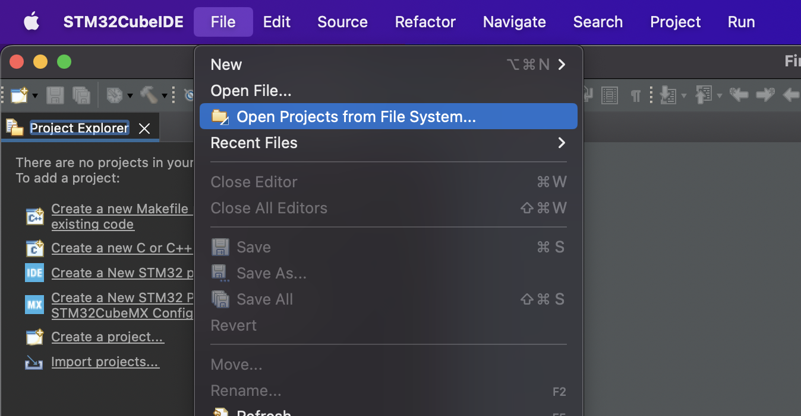

# Welcome to our Embeded System Lab Final Project Repository

**Table of Contents**

- [Click here for Website](#website)

- [Click here for NodeMCU](#nodemcu)

- [Click here for STM32](#stm32)

 
 

# Task lists

- Website

  - ~~Initial nextjs project~~
  - ~~Design website~~
  - ~~Making website layout~~
  - ~~Connect to Firebase~~

- NodeMCU

  - ~~Initial NodeMCU project~~
  - ~~Connect to Wifi~~
  - ~~Connect to Firebase~~
  - Communicate with Firebase
    - ~~Read data~~
    - ~~Write data~~
    - Listening data changing
  - Communicate between STM32
    - Send
    - Recieve
    - Send custom command to NodeMCU
    - Recieve sensor data from STM32

- STM32

  - ~~Initial STM32 project~~
  - ~~Read sensor~~
    - ~~DHT11~~
    - ~~Soil moisture~~
    - ~~LDR~~
  - Communicate between NodeMCU
    - Recieve
    - Send
    - Pack data and send
    - Handle other commands

 
 

## **Website**

  
How to open project

   

  <ol>
  <li>
  Open Terminal or CMD
  
  </li>

  <li>
  Navigate to Website folder in Project folder
  
  </li>

  <li>
  Launch it with VScode or other tools
  
  </li>

  <li>
  Done
  
  </li>
  </ol>

 

  
How to develop or launch

   

  <ol>
  <li>
  Open Terminal or CMD
  
  </li>

  <li>
  Navigate to Website folder in Project folder
  
  </li>

  <li>

`yarn`
to install dependencies for the first time

  </li>

  <li>

`yarn dev`
to start development server

  </li>

  <li>

Visit `localhost:3000` in your browser to see the web application

  </li>
  </ol>

 

How to use and how it work

 
In progress....

 
 
 
 

## **NodeMCU**

  
How to download ArduinoIDE

  <ol>
  <li>

Go to `https://www.arduino.cc/en/software` and select your OS

  </li>

  <li>

Click `Just Download` to download and install

  </li>

  <li>
Launch ArduinoIDE application

  </li>

  <li>

Open setting or preferences

  </li>

  <li>

Add `http://arduino.esp8266.com/stable/package_esp8266com_index.json` in Additional Boards Manager URLs, then click `OK`

  </li>

  <li>

Click `Board Manager`

  </li>

  <li>

Search for `esp8266` and click `INSTALL`

  </li>

  <li>

Now you can see `esp8266` in board menu

  </li>

  </ol>

 

  
How to open project

  
   

  <ol>
  <li>
  Launch ArduinoIDE application
  
  </li>

  <li>
  Click File > Open
  
  </li>

  <li>
  Navigate to nodemcu.ino in our project directory
  
  </li>

  <li>
  Click open and done
  
  </li>
  <ol>

 

  
How to upload code to board

  
   

  <ol>
  <li>
  Launch ArduinoIDE application
  
  </li>

  <li>
  Click File > Open
  
  </li>

  <li>
  Navigate to nodemcu.ino in our project directory
  
  </li>

  <li>
  Click open
  
  </li>

  <li>

Click `Select Board` and choose your device port

  </li>

  <li>

Set Board to `Generic ESP8266 Module` for your device and click `OK`

  </li>

  <li>
  Click check button to compile the code
  
  </li>

  <li>
  Click arrow button to upload code to your device and done
  
  </li>
  <ol>

 
 
 
 

## **STM32**

  
How to open project

   
  
  <ol>

  <li>

Launch STM32CubeIDE and set workspace to our project directory the click to create `Launch`

  </li>

  <li>

Click File > Open Projects from File System...

  </li>

  <li>

Click `Directory...`

  </li>

  <li>

Select STM32 folder in your project directory

  </li>

  <li>

Click `Finish`

  </li>

  <li>

Done

  </li>

  </ol>

